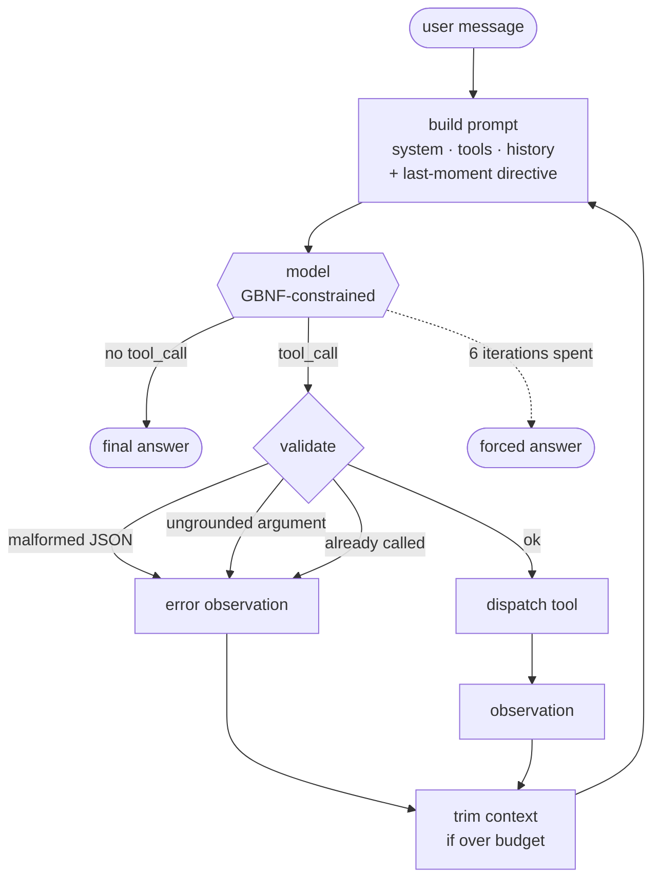

<div align="center">

# 🇹🇷 Llama Turkish Function-Calling Agent

**Llama-3.1-8B → QLoRA → GGUF → a tool-calling agent that answers in Turkish, on a single 8 GB laptop GPU.**

<p>
  
  
  
  
  
  
  
  
</p>

<table>
<tr>
<td align="center"><b>95%</b><br><sub>on tool schemas<br>never seen in training</sub></td>
<td align="center"><b>100%</b><br><sub>valid JSON<br>tool calls</sub></td>
<td align="center"><b>~40</b><br><sub>tokens/sec<br>generation</sub></td>
<td align="center"><b>79</b><br><sub>held-out records,<br>hand written</sub></td>
</tr>
</table>

</div>

---

## 🎯 The question

Most function-calling fine-tunes are trained and evaluated in English. This project asks a narrower one:

> Can a small, carefully-curated Turkish subset — about **2%** of the training mix — reliably steer a model's *final, user-facing* answers into Turkish, without touching the English tool-calling semantics that make up the rest, and without anything close to a large Turkish corpus?

The answer depends entirely on **how** that 2% is trained on, not just that it exists. That distinction drives most of what follows.

---

## ⚡ Quick start

```bash
# 1 — serve the model (keep this terminal open)
cd <llama.cpp build directory>
LD_LIBRARY_PATH=.:$LD_LIBRARY_PATH ./llama-server \
  -m training/outputs/gguf/llama31-8b-tr-Q4_K_M.gguf \
  -c 8192 -np 1 -ngl 99 -fa on \
  --cache-type-k q8_0 --cache-type-v q8_0 \
  --host 127.0.0.1 --port 8080

# 2 — talk to it
python inference/orchestrator.py --verbose
```

```
siz > Yarın Ankara'da hava nasıl olacak?
  · get_weather({'location': 'Ankara', 'days_ahead': 1}) -> ok
ajan> Ankara'da yarın hava parçalı bulutlu olacak; sıcaklık 14 ile 26 derece
      arasında seyredecek ve yağış ihtimali görünmüyor. …
```

<sub>`--verbose` logs each tool call and its outcome · `--variant` picks a system prompt · `--lang` forces the answer language · `--no-grammar` disables constrained decoding</sub>

> ⚠️ **Turkish output is currently suspended** (`DEFAULT_LANGUAGE = "en"`). Every defect still open has the same shape — *works in English, fails in Turkish* — so the language variable is pinned while the English baseline is measured. `--lang tr` or `--lang auto` restores it.

---

## 🔄 How a turn works



Three things in that picture are the result of measurement rather than design:

- **The last-moment directive** carries the answer language, the length policy and the unit rule. It sits at the *end* of the prompt, not in the system block, because the same words had no effect 1500 tokens earlier — recency is what moved the model, not wording. It is appended after the cached prefix, so the system prompt's KV cache survives.
- **Validation has three failure branches, and none of them dispatch.** Malformed JSON, an argument that cannot be traced back to the conversation, and a call already made this turn all become observations the model reads and reacts to — the loop never crashes and never acts on invented input.
- **The model is GBNF-constrained.** Not for style: a tool absent from the training data made it emit `"arguments"` as a bare string, and the grammar makes that shape unrepresentable.

---

## 🧩 Key design decisions

| | |
|---|---|
| 🌍 **Hybrid language strategy** | System prompts, tool schemas and `tool_call` JSON stay English throughout. Only the user-facing layer is localized — the model isn't learning a new skill in Turkish, only redirecting an existing one. |
| 🎭 **Two-layer loss masking** | "Train on responses only" computes loss over *every* assistant turn, including English final-turn prose. Unmasked, that is a gradient contradicting the Turkish instruction at the same token position for most of the run. Masking the English final turn makes the Turkish subset the **sole** source of final-turn behaviour instead of fighting it at ~50:1. |
| 📦 **Quantization-aware merge** | An intermediate `q8_0` GGUF (half the disk of `f16`, no measurable K-quant cost) plus an **importance matrix** built from the real training distribution before the final `Q4_K_M` pass — a calibration run traded for a smaller quality gap at the same file size. |
| 🎲 **Single training run** | No retry budget. Dataset prep, masking and the Turkish subset are all built to be auditable **before** the run, not patched after. |
| 🔧 **Control lives in code** | Where the model has a learned habit a prompt cannot reliably override, the orchestrator or the tool enforces the behaviour instead. Every case below was *measured*, not assumed. |

---

## 🧰 Tools

| tool | what it does | the interesting part |
|---|---|---|
| 🔎 `google_search` | Web search | Provider chain **Tavily → DuckDuckGo → Wikipedia** with bot-challenge detection. Three trimming layers; `num_results` is a **floor**, not a ceiling. |
| 🌤️ `get_weather` | Current + forecast | `days_ahead` (0–7). Resolves diacritic-free city names (`Elazig` → `Elâzığ`) and prefers the most populous match. |
| 🕐 `get_system_time` | Date and time | IANA timezone inference from a city name. |
| 🧮 `calculate` | Arithmetic | AST-based, **never `eval()`**. Takes a `unit` so a bare number cannot pass as an answer. |

`tools/__init__.py` is the hub: the system prompt, the grammar and the dispatcher all read the same registry, so one can never be updated while another is forgotten. Adding a tool is one file plus one list entry — the grammar regenerates itself.

---

## 📊 Evaluation

`eval/test_set.jsonl` is a **79-record held-out set, written by hand**. It was screened against the training data for verbatim matches and at a 0.70 similarity threshold — five real leaks were found and rewritten. Every tool name claimed as "unseen" was checked against all **2,985** tool names in the training data; intuitive picks like `convert_currency`, `translate_text` and `find_restaurants` turned out to be present and were replaced.

Scored on the full set with the **grammar on**, which is how the agent runs:

| Metric | Score | |
|---|---|---|
| 🔓 **Unseen tool schemas** | **23/24** | `██████████ 95%` |
| 🔑 Seen tool schemas | 44/51 | `█████████░ 86%` |
| ✅ JSON validity | 54/54 | `██████████ 100%` |
| 🧮 Arithmetic routed to a tool | 5/5 | `██████████ 100%` |
| 🗣️ Turkish final turn after an observation | 6/6 | `██████████ 100%` |

> **The first two rows are the whole point.** Equal performance on schemas the model has never seen means it learned *"read the schema, build the call"* rather than memorizing tool names.

Records where more than one behaviour is defensible are **reported, not scored**. Inventing a reference answer to make a metric look complete would have made the metric worse.

### Grammar: off vs on

The same 79 records, the same prompt, one flag apart:

| | grammar off | grammar on |
|---|---|---|
| Overall | 63/75 · 84% | **67/75 · 89%** |
| Unseen tool schemas | 20/24 · 83% | **23/24 · 95%** |
| JSON validity | 52/54 · 96% | **54/54 · 100%** |
| Arithmetic routed to a tool | 2/5 · 40% | **5/5 · 100%** |

No category regressed, so the grammar is on by default.

---

## 🔬 What measurement changed

Each of these was a live or evaluated failure, traced to a cause, and fixed **in code** rather than by rewording a prompt.

<details>
<summary><b>🕳️ The masking silently deleted training data</b></summary>

Hermes examples that answer directly, without a tool, consist of nothing *but* a final turn — so masking the final turn masked the whole example and dropped it. **803 of 851** such examples vanished, leaving a **1:71** skew toward calling a tool. The model over-triggered exactly as that ratio predicts.
</details>

<details>
<summary><b>👻 The model fabricates arguments it does not have</b></summary>

`"Hava nasıl?"` (no city given) produced `location='Ankara'`. `"Ankara'dan tren var mı?"` produced `destination="user's destination"` — a literal placeholder, meaning the model *knows* it does not know and fills the slot anyway. No prompt variant fixed it, so `orchestrator._ungrounded()` refuses to dispatch such a call and asks the user instead.
</details>

<details>
<summary><b>1️⃣ <code>num_results=1</code> was learned, not chosen</b></summary>

The training data calls `google_search` with `num_results=1` in **34 of 55** cases. The model asks for one source out of habit. The tool now treats the parameter as a **floor**, not a ceiling.
</details>

<details>
<summary><b>🤖 A blocked search was reported as an empty one</b></summary>

DuckDuckGo answers **HTTP 202 with a CAPTCHA** after ~7 requests on `/lite` and after **2** on `/html`; the tool read that as a successful search with zero hits and told the model *"nothing was found"* — which the model then relayed to the user as fact. Scraping was measured to be unworkable here, so search became a provider chain with explicit block detection, and every failure message now tells the model not to claim it searched.
</details>

<details>
<summary><b>🧮 Arithmetic was wrong, and the error propagated</b></summary>

Asked how much memory FP16 weights need in INT4, the model answered *"1 FP16 = 2 INT4, so 32 GB"* — the ratio is 4, the operation is division, the answer is 4 GB. The next turn then **reused that wrong ratio as a premise** and produced *"256 billion 7B parameters fit in 32 GB"*. A wrong answer sat in the history as fact and became the foundation of the next one; nothing in the loop caught it.

`calculate` moves the arithmetic into code. It parses the expression to an AST and evaluates only whitelisted node types — `eval()` is never called, so no `tool_call` can execute anything.

**Half-solved, honestly.** The arithmetic is now exact, but the model still builds unit-inconsistent expressions: it once computed `32*1024/16` for a question whose answer is ~17 billion. The `unit` parameter and the byte constants in the schema description push back, and the directive makes it write the units out before calculating — but writing *"1 GB = 1024³ bytes"* and then using `10⁹` in the next line still happens. Prompting shapes the form; only an interface change would force the substance.
</details>

<details>
<summary><b>🔒 The grammar had three traps, all of which looked like model failures</b></summary>

1. The root accepted **only** `<tool_call>`, so a plain answer was impossible — every question was forced into a tool call.
2. The eval read the grammar from a **fixed file**, which restricted every record to production's tools. Records built on unseen schemas could not select them and scored **0/11**. The grammar must be built from the **call site's** tool bundle.
3. It permitted exactly one call, so multi-call records scored 0/2.

All three were harness bugs, and all three showed up in the report as if the model had failed.
</details>

<details>
<summary><b>✂️ Short answers are a learned length</b></summary>

Turkish final turns in the training data have a **median of 118 characters**. A length instruction in the system prompt barely moved it; the same instruction rendered *immediately before generation* does — recency is what matters, not wording.
</details>

---

## 🏗️ Architecture

```
training/
  prepare_dataset.ipynb     # Hermes -> Llama-3.1 chat template conversion
  train.py                  # QLoRA fine-tuning with two-layer loss masking
  merge_and_quantize.py     # LoRA merge -> GGUF (q8_0 -> imatrix -> Q4_K_M)
  turkish_examples/         # Curated Turkish subset + curation methodology

inference/
  config.py                 # .env reader (stdlib only, no python-dotenv)
  prompts.py                # System prompt + variants; one source for agent AND eval
  serve.py                  # HTTP client to llama-server (model access layer)
  orchestrator.py           # ReAct loop: parsing, grounding, pruning, limits
  grammar/generate_gbnf.py  # GBNF generated from the live tool registry
  tools/                    # Registry + google_search, get_weather,
                            #            get_system_time, calculate

eval/
  test_set.jsonl            # 79-record held-out set, 24 of them on unseen schemas
  validate_test_set.py      # structural checks - run after every edit
  test_set_SEMA.md          # record schema and scoring rules
  test_set_SEMA.md          # Record schema and scoring rules
  eval_post_quant.py        # Scores the quantized model against the set
  eval_pre_quant.py         # bfloat16 baseline (not run — see Status)
```

`tools/__init__.py` is the hub: the system prompt, the grammar and the dispatcher all read from the same registry, so one can never be updated while another is forgotten.

---

## 💻 Hardware

Training and inference run on **different machines on purpose**, and the pipeline is built around that split.

| Stage | Hardware | Role |
|---|---|---|
| 🏋️ Training | 4× H100 (cloud) | QLoRA fine-tuning in bfloat16 |
| 🔀 Merge & quantize | CPU (cloud VM) | LoRA merge, GGUF conversion, imatrix calibration |
| 🎮 Inference | RTX 4060 Laptop, 8 GB | GGUF served by `llama-server` (llama.cpp, Vulkan) |

Measured at `n_ctx=8192`, `Q4_K_M`, q8_0 KV cache, flash attention:

| | |
|---|---|
| Model weights | 4403 MiB |
| KV cache | 544 MiB · **68 KB/token** |
| Compute buffer | 108 MiB |
| **Total** | **5055 / 7774 MiB** — ~2.7 GB headroom |
| Generation | ~40 tok/s |
| Prompt processing | ~175 tok/s |

> 💡 **Memory turned out not to be the binding constraint — prompt processing is.** Every 1000 tokens of context costs ~6 seconds on *every* subsequent turn. That is why the orchestrator trims context and the search tool trims its own output.

<details>
<summary><b>Why <code>llama-server</code> instead of in-process <code>llama-cpp-python</code></b></summary>

The spec called for an in-process `Llama()` object. That needs the CUDA toolkit, which this machine does not have, while llama.cpp's prebuilt **Vulkan** binaries already worked. `serve.py` is therefore an HTTP client. Nothing was lost — every setting the spec required exists as a server flag, and prefix caching works over HTTP (measured: **14 tokens processed instead of 440** on the second request). Something was gained: the model process now survives across sessions, not just turns.
</details>

---

## 📦 Setup

```bash
pip install -r requirements.txt
# torch is installed separately, matching your CUDA version:
python -m pip install torch --index-url https://download.pytorch.org/whl/cu121
```

> Inference needs **no Python dependencies beyond the standard library** — only a running `llama-server`.

### 🔎 Search provider

Copy your [Tavily](https://app.tavily.com) key into `.env` (git-ignored):

```ini
TAVILY_API_KEY=tvly-...
```

The chain is **Tavily → DuckDuckGo → Wikipedia**. Tavily leads because it is the only provider here not fighting a bot filter, and because it returns page text directly — its results skip the page-fetch step entirely. Without a key the agent still runs on the keyless fallbacks, which last a handful of queries before DuckDuckGo starts serving CAPTCHAs.

Adding another provider means writing **one function** and listing it in `PROVIDERS`.

---

## 🚦 Status

| Component | |
|---|---|
| Dataset preparation (Hermes + Turkish subset) | ✅ Done |
| QLoRA training script | ✅ Done |
| LoRA merge / GGUF quantization pipeline | ✅ Done, validated end-to-end |
| Tool layer + registry (4 tools) | ✅ Done |
| Arithmetic tool (`calculate`) | ✅ Done *(units partly solved — see above)* |
| GBNF grammar generation | ✅ Done *(now on by default — see below)* |
| Inference server & ReAct orchestrator | ✅ Done |
| Evaluation harness | ✅ Done |
| bfloat16 baseline comparison | ❌ **Not possible** — the merged bf16 model was deleted by the quantize pipeline before a baseline was taken |

The grammar layer **started as insurance and became a requirement**. With only the three tools it was trained on, the model produced 100% valid JSON unaided. Adding `calculate` — a tool absent from the training data — broke that: it emitted `"arguments": "16 * 2"`, a bare string where an object belongs. Measured across the full set, the grammar takes JSON validity from 96% to 100% and the reasoning category from 40% to 100%, with no category regressing. It is on by default; `--no-grammar` turns it off.

One constraint that is easy to get wrong: the grammar must be built from **the tools of the call site**, not from the global registry. Building it once from the registry forbids every tool a caller declares that production does not have — the model is then forced to pick a production tool instead, which scored 0/11 on unseen schemas and looked exactly like a model failure.

---

## 🛠️ Commands

```bash
python inference/orchestrator.py --verbose             # interactive agent
python eval/eval_post_quant.py --grammar --out r.json  # score against the test set
python eval/validate_test_set.py                       # check the test set itself
python inference/grammar/generate_gbnf.py              # inspect the generated grammar
```

Training and merge/quantize scripts run independently — see the comment block at the top of each script for hardware assumptions and expected runtimes.
