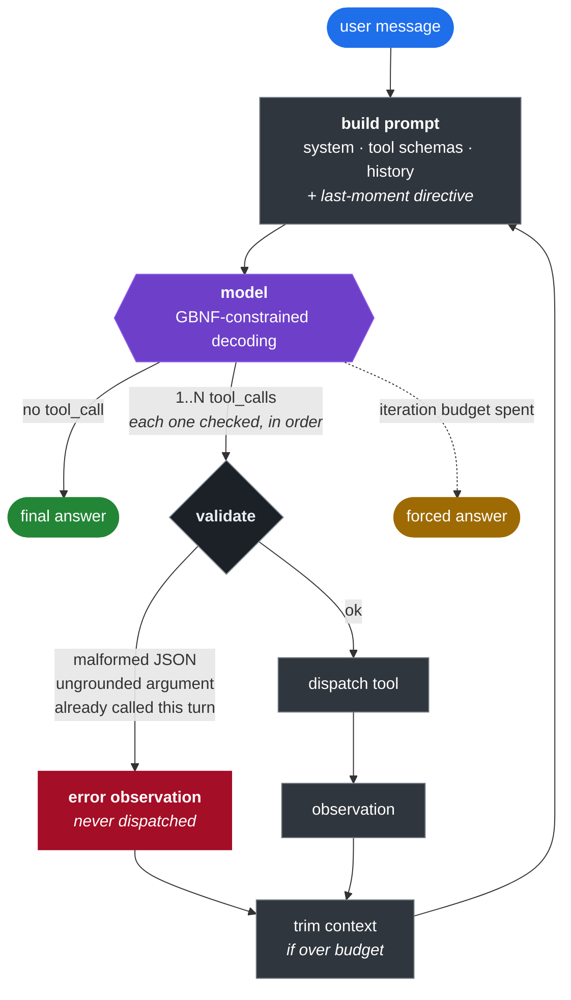

<div align="center">

# 🇹🇷 Llama Turkish Function-Calling Agent

### Llama-3.1-8B → QLoRA → GGUF → a tool-calling ReAct agent<br>running entirely on one 8 GB laptop GPU

<p>
  
  
  
</p>
<p>
  
  
  
  
  
  
  
</p>

<table>
<tr>
<td align="center" width="25%"><h2>92%</h2><sub><b>24 / 26</b><br>on tool schemas<br>never seen in training</sub></td>
<td align="center" width="25%"><h2>100%</h2><sub><b>57 / 57</b><br>syntactically valid<br>JSON tool calls</sub></td>
<td align="center" width="25%"><h2>86</h2><sub>held-out records,<br>written by hand,<br>leak-screened</sub></td>
<td align="center" width="25%"><h2>~40</h2><sub>tokens/sec<br>generation on a<br>laptop RTX 4060</sub></td>
</tr>
</table>

</div>

> [!IMPORTANT]
> **The agent currently answers in English.** `DEFAULT_LANGUAGE = "en"`.
> Every defect still open has the same shape — *works in English, fails in Turkish* — so the
> language variable is pinned while the English baseline is measured. At this setting the prompt
> does not mention Turkish **at all**: the system prompt's language clause follows the configured
> language instead of naming both, so it can no longer contradict the last-moment directive.
> Turkish is one flag away: `--lang tr` pins it, `--lang auto` mirrors the user.

---

## 🧭 Find your way

| | | |
|:--|:--|:--|
| [🎯 **The question**](#-the-question)<br><sub>what this project actually asks</sub> | [⚡ **Quick start**](#-quick-start)<br><sub>two terminals, no build step</sub> | [🔄 **How a turn works**](#-how-a-turn-works)<br><sub>the ReAct loop, drawn</sub> |
| [🧩 **Design decisions**](#-key-design-decisions)<br><sub>the five that shaped everything</sub> | [🧰 **Tools**](#-tools)<br><sub>four, one registry</sub> | [📊 **Evaluation**](#-evaluation)<br><sub>86 records, full breakdown</sub> |
| [🔬 **What measurement changed**](#-what-measurement-changed)<br><sub>nine failures, traced and fixed</sub> | [🏗️ **Architecture**](#-architecture)<br><sub>file map</sub> | [💻 **Hardware**](#-hardware)<br><sub>where each stage runs</sub> |
| [📦 **Setup**](#-setup)<br><sub>install + search key</sub> | [🚦 **Status**](#-status)<br><sub>what is done, what cannot be</sub> | [🛠️ **Commands**](#️-commands)<br><sub>copy-paste reference</sub> |

---

## 🎯 The question

Most function-calling fine-tunes are trained and evaluated in English. This project asks a narrower one:

> Can a small, carefully-curated Turkish subset — about **2%** of the training mix — reliably steer a
> model's *final, user-facing* answers into Turkish, without touching the English tool-calling
> semantics that make up the rest, and without anything close to a large Turkish corpus?

The answer depends entirely on **how** that 2% is trained on, not just that it exists. That distinction
drives most of what follows.

---

## ⚡ Quick start

```bash
# 1 — serve the model (keep this terminal open)
cd <llama.cpp build directory>
LD_LIBRARY_PATH=.:$LD_LIBRARY_PATH ./llama-server \
  -m training/outputs/gguf/llama31-8b-tr-Q4_K_M.gguf \
  -c 8192 -np 1 -ngl 99 -fa on \
  --cache-type-k q8_0 --cache-type-v q8_0 \
  --host 127.0.0.1 --port 8080

# 2 — talk to it
python inference/orchestrator.py --verbose
```

```console
you > How will the weather be today in Elazig, Turkey? Then tell me what 4 - 5 is.
  · 2 calls in one generation
  · get_weather({'location': 'Elazig', 'unit': 'celsius'}) -> ok
  · calculate({'expression': '4 - 5', 'unit': ''}) -> ok
agent> The current temperature in Elazig, Turkey is 28.8 degrees Celsius under clear
       skies. As for your second question, the result of 4 minus 5 is -1.
```

<div align="center">

| flag | effect |
|:--|:--|
| `--verbose` | logs **every** call and its outcome — dispatched, blocked, or unparseable |
| `--lang {en,tr,auto}` | pin the answer language, or mirror the user |
| `--variant {V0..V3}` | pick a system prompt variant |
| `--no-grammar` | turn off constrained decoding (on by default) |
| `--no-stream` | wait for the whole answer instead of streaming it as it is written |

</div>

---

## 🔄 How a turn works



Four things in that picture are the result of measurement rather than design:

- 📍 **The last-moment directive** carries the answer language, the length policy, the coverage rule and
  the unit rule. It sits at the *end* of the prompt, not in the system block, because the same words had
  no effect 1500 tokens earlier — recency is what moved the model, not wording. It is appended after the
  cached prefix, so the system prompt's KV cache survives.
- 🔢 **`1..N` calls, not one.** The grammar allows a run of calls and the model uses it. The parser used to
  read only the first and drop the rest silently — a harness bug that read exactly like a model failure.
- 🛡️ **Validation has three failure branches, and none of them dispatch.** Malformed JSON, an argument that
  cannot be traced back to the conversation, and a call already made this turn all become observations the
  model reads and reacts to — the loop never crashes and never acts on invented input.
- 🔒 **The model is GBNF-constrained.** Not for style: a tool absent from the training data made it emit
  `"arguments"` as a bare string, and the grammar makes that shape unrepresentable.

> [!NOTE]
> **In practice the loop runs one iteration.** Across 9146 training examples, of the **8144** assistant
> turns that follow an observation, **zero** are a tool call. The model has never seen "observe, then call
> again", so a compound request has to be satisfied by the first generation. The six-iteration budget is a
> safety bound, not a working mechanism. See [What measurement changed](#-what-measurement-changed).

---

## 🧩 Key design decisions

| | |
|:--|:--|
| 🌍 **Hybrid language strategy** | System prompts, tool schemas and `tool_call` JSON stay English throughout. Only the user-facing layer is localized — the model isn't learning a new skill in Turkish, only redirecting an existing one. |
| 🎭 **Two-layer loss masking** | "Train on responses only" computes loss over *every* assistant turn, including English final-turn prose. Unmasked, that is a gradient contradicting the Turkish instruction at the same token position for most of the run. Masking the English final turn makes the Turkish subset the **sole** source of final-turn behaviour instead of fighting it at ~50:1. |
| 📦 **Quantization-aware merge** | An intermediate `q8_0` GGUF (half the disk of `f16`, no measurable K-quant cost) plus an **importance matrix** built from the real training distribution before the final `Q4_K_M` pass — a calibration run traded for a smaller quality gap at the same file size. |
| 🎲 **Single training run** | No retry budget. Dataset prep, masking and the Turkish subset are all built to be auditable **before** the run, not patched after. |
| 🔧 **Control lives in code** | Where the model has a learned habit a prompt cannot reliably override, the orchestrator or the tool enforces the behaviour instead. Every case below was *measured*, not assumed. |

---

## 🧰 Tools

| tool | what it does | the interesting part |
|:--|:--|:--|
| 🔎 `google_search` | Web search | Provider chain **Tavily → DuckDuckGo → Wikipedia** with bot-challenge detection. Three trimming layers; `num_results` is a **floor**, not a ceiling. |
| 🌤️ `get_weather` | Current + forecast | `days_ahead` (0–7). Resolves diacritic-free city names (`Elazig` → `Elâzığ`) and prefers the most populous match. Forecast and "now" return **different shapes** on purpose. |
| 🕐 `get_system_time` | Date and time | IANA timezone inference from a city name. Weekday comes from an explicit table — `strftime("%A")` follows the OS locale. |
| 🧮 `calculate` | Arithmetic | AST-based, **never `eval()`**. Takes a `unit` so a bare number cannot pass as an answer. |

`tools/__init__.py` is the hub: the system prompt, the grammar and the dispatcher all read the same
registry, so one can never be updated while another is forgotten. Adding a tool is one file plus one list
entry — the grammar regenerates itself.

---

## 📊 Evaluation

`eval/test_set.jsonl` is an **86-record held-out set, written by hand**. It was screened against the
training data for verbatim matches and at a 0.70 similarity threshold — five real leaks were found and
rewritten. Every tool name claimed as "unseen" was checked against all **2,985** tool names in the
training data; intuitive picks like `convert_currency`, `translate_text` and `find_restaurants` turned out
to be present and were replaced.

Scored on the full set with the **grammar on**, which is how the agent runs:

| Metric | Score | |
|:--|--:|:--|
| 🔓 **Unseen tool schemas** | **24 / 26** | `█████████░ 92%` |
| 🔑 Seen tool schemas | 48 / 56 | `████████░░ 85%` |
| ✅ JSON validity | 57 / 57 | `██████████ 100%` |
| 🧮 Arithmetic routed to a tool | 5 / 5 | `██████████ 100%` |
| 🗣️ Turkish final turn after an observation | 6 / 6 | `██████████ 100%` |
| 🎓 Unseen-schema calls built correctly | 11 / 11 | `██████████ 100%` |
| 🧵 **Overall** | **72 / 82** | `█████████░ 87%` |

> **The first two rows are the whole point.** Near-equal performance on schemas the model has never seen
> means it learned *"read the schema, build the call"* rather than memorizing tool names.

<details>
<summary><b>📋 Full category breakdown</b></summary>

<br>

| category | score | what it measures |
|:--|:--|:--|
| `unseen_positive` | **11/11** | the real generalization test — correct call from a schema never seen |
| `unseen_negative` | **5/5** | staying frugal even with unfamiliar schemas on the table |
| `seen_positive` | 5/6 | baseline: correct tool + arguments inside the training distribution |
| `seen_negative` | **8/8** | not calling a tool when none is needed |
| `boundary_positive` | **6/6** | live/changing information → a search is required |
| `boundary_ambiguous` | *4 unmeasured* | both behaviours defensible — reported, never scored |
| `missing_argument` | 1/4 | not fabricating a missing required argument |
| `wrong_tool_trap` | 3/5 | keyword collision without picking the wrong tool |
| `observation_final` | **6/6** | the project's main goal — correct final turn after an observation |
| `multi_turn` | **3/3** | carrying context, not re-calling needlessly |
| `multi_call` | **2/2** | situations needing more than one tool |
| `compound_request` | 5/7 | **new** — several tasks in one message |
| `reasoning` | **5/5** | arithmetic routed to `calculate` |
| `forecast` | **5/5** | reading `days_ahead` out of the question |
| `query_language` | 1/3 | Turkish question → Turkish search query |
| `explicit_search` | **4/4** | honouring an explicit request to search |
| `user_language_edge` | **2/2** | short or mixed messages and language detection |

**`missing_argument` scores 1/4 by design.** The eval scores the raw model, and the model *does* fabricate
(`location='Ankara'` for a question naming no city). In production `orchestrator._ungrounded()` refuses to
dispatch those calls — the defect is real, and it is handled in code rather than by the model.

</details>

### Grammar: off vs on

The same 86 records, the same prompt, one flag apart:

| | grammar off | grammar on | |
|:--|:--|:--|:--|
| Overall | 71/82 · 86% | **72/82 · 87%** | +1 |
| JSON validity | 56/59 · 94% | **57/57 · 100%** | **+6 pts** |
| Unseen tool schemas | 24/26 · 92% | 24/26 · 92% | — |
| `compound_request` | 4/7 · 57% | **5/7 · 71%** | +1 |

**No category regressed, so the grammar stays on by default.** But the interesting part is *where* the
difference lands. Exactly one record produced unparseable output without the grammar — `S03`, the record
that asks for two searches. Unconstrained, the model emitted **three malformed `<tool_call>` blocks** and
scored zero. Constrained, it emitted two clean ones.

> [!NOTE]
> An earlier comparison on the 79-record set showed a wider gap (84% → 89%, arithmetic 40% → 100%). That
> larger arithmetic gap did **not** reproduce in this run — unconstrained decoding scored 5/5 on `reasoning`
> here. The effect that reproduces is JSON validity, and it concentrates on multi-call generations, which is
> also the hardest shape for the model to get right unaided. Both runs are reported rather than the
> flattering one.

<details>
<summary><b>🔍 Records that are read by hand, not scored</b></summary>

<br>

Records where more than one behaviour is defensible are **reported, not scored**. Inventing a reference
answer to make a metric look complete would have made the metric worse.

Three records are read by eye every run, because no automatic check is trustworthy for them: `I05`
(tool error relayed honestly?), `I06` ("quantum swing theory" — a thing that does not exist) and `N04`
("Glisandra syndrome" — likewise). In the latest run **`I06` and `N04` both still fabricated**, confidently
and fluently, while `observation_final` reported 6/6. That gap is the point of reading them.

</details>

---

## 🔬 What measurement changed

Each of these was a live or evaluated failure, traced to a cause, and fixed **in code** rather than by
rewording a prompt — or, in two cases, deliberately *not* fixed because the measurement said the fix would
cost more than the bug.

<details>
<summary><b>🕳️ The masking silently deleted training data</b></summary>

<br>

Hermes examples that answer directly, without a tool, consist of nothing *but* a final turn — so masking
the final turn masked the whole example and dropped it. **803 of 851** such examples vanished, leaving a
**1:71** skew toward calling a tool. The model over-triggered exactly as that ratio predicts.
</details>

<details>
<summary><b>🔗 The loop executed one call and silently dropped the rest</b></summary>

<br>

The grammar allowed `tool-call (ws-nl tool-call)*` and the eval parsed every block with `finditer` — but
the orchestrator's parser used `search`, took the **first** call and discarded the others with no log, no
observation and no error. The model never learned its second call had been eaten.

Live, *"search what tensors are and what RAG is, use 2 searches"* ran one search and answered half the
question. That reads as a model failure; it was a harness bug — the same shape as the three grammar traps
below. After the fix the model emits both calls in a single generation on **5 of 5** records that need two,
and the two-task weather-plus-arithmetic turn works end to end.

**Every branch is logged now.** The old log printed only dispatched calls, so a blocked or unparseable one
was invisible — precisely the case that looks like the model ignoring the user.
</details>

<details>
<summary><b>🚧 …and behind it, a wall: "observe, then call again" has zero training support</b></summary>

<br>

Once an observation arrives, the model writes the final answer. It does not issue another call. That is not
a weak habit — it is absolute:

| | |
|:--|--:|
| training examples scanned | 9,146 |
| assistant turns that follow an observation | 8,144 |
| **of those, tool calls** | **0 (0.00%)** |

The conversation shapes are always `CALL-OBS-PROSE` or `CALL-OBS-PROSE-CALL-OBS-PROSE` — a second call only
ever appears after a new user turn. A directive telling the model to continue scored **0/3**, which is what
a behaviour with zero training support at that position should score.

So the ReAct loop is single-iteration in practice, and compound requests must be satisfied by the first
generation — which is exactly what the parser fix restored. Closing this properly would need training data,
and this project has a one-run budget.
</details>

<details>
<summary><b>👻 The model fabricates arguments it does not have</b></summary>

<br>

`"Hava nasıl?"` (no city given) produced `location='Ankara'`. `"Ankara'dan tren var mı?"` produced
`destination="user's destination"` — a literal placeholder, meaning the model *knows* it does not know and
fills the slot anyway. No prompt variant fixed it, so `orchestrator._ungrounded()` refuses to dispatch such
a call and asks the user instead.

**With one correction found later:** the guard applied to *every* string argument, including optional ones.
`calculate`'s `unit` is optional, its description says "always give it", and `4 - 5` has no unit — so the
model reaches for `n/a` / `none` / `null`, all three of which match the placeholder pattern. A correctly
formed arithmetic call was being refused. The rule is now split by schema: a placeholder in a **required**
slot is a fabrication and blocks; in an **optional** slot it means "I had nothing to put here", so the
argument is dropped and the call proceeds.
</details>

<details>
<summary><b>1️⃣ <code>num_results=1</code> was learned, not chosen</b></summary>

<br>

The training data calls `google_search` with `num_results=1` in **34 of 55** cases. The model asks for one
source out of habit. The tool now treats the parameter as a **floor**, not a ceiling.
</details>

<details>
<summary><b>🤖 A blocked search was reported as an empty one</b></summary>

<br>

DuckDuckGo answers **HTTP 202 with a CAPTCHA** after ~7 requests on `/lite` and after **2** on `/html`; the
tool read that as a successful search with zero hits and told the model *"nothing was found"* — which the
model then relayed to the user as fact. Scraping was measured to be unworkable here, so search became a
provider chain with explicit block detection, and every failure message now tells the model not to claim it
searched.
</details>

<details>
<summary><b>🧮 Arithmetic was wrong, and the error propagated</b></summary>

<br>

Asked how much memory FP16 weights need in INT4, the model answered *"1 FP16 = 2 INT4, so 32 GB"* — the
ratio is 4, the operation is division, the answer is 4 GB. The next turn then **reused that wrong ratio as
a premise** and produced *"256 billion 7B parameters fit in 32 GB"*. A wrong answer sat in the history as
fact and became the foundation of the next one; nothing in the loop caught it.

`calculate` moves the arithmetic into code. It parses the expression to an AST and evaluates only
whitelisted node types — `eval()` is never called, so no `tool_call` can execute anything.

**And this is not cosmetic.** On the record that asks for `4 - 5` after a weather observation, the model
answered in prose: *"Now, let's calculate 4 - 5. The result is 3."* The live transcript that produced `-1`
was lucky, not correct.

**Half-solved, honestly.** The arithmetic is now exact, but the model still builds unit-inconsistent
expressions. The `unit` parameter and the byte constants in the schema description push back, and the
directive makes it write the units out before calculating — but writing *"1 GB = 1024³ bytes"* and then
using `10⁹` in the next line still happens.
</details>

<details>
<summary><b>🚫 An arithmetic gate was designed, measured, and not shipped</b></summary>

<br>

The obvious next step was a hard rule: *if the user wrote a calculation and `calculate` was never called,
refuse the answer.* Before building it, the trigger pattern was measured against the **7,549 unique user
messages** in the training data:

| pattern | fires on |
|:--|--:|
| naive `\d+\s*[-+*/]\s*\d+` | **4.85%** |
| narrowed (ISO dates and year ranges removed first) | **1.44%** |

The remaining hits are almost all false positives — phone numbers, *"the digits 1-9"*, pasted passages,
*"MATLAB code to calculate…"*. And the pattern **misses** arithmetic phrased in words: *"17 ile 23'ün
çarpımı kaçtır?"* contains no operator at all.

Noisy **and** leaky: as a gate it would refuse roughly one legitimate turn in seventy while still missing
the cases it was built for. So it ships as a `--verbose` warning instead, and a test record measures whether
the directive alone is enough.
</details>

<details>
<summary><b>♻️ A stale answer leaked into an unrelated turn</b></summary>

<br>

An answer about deep learning ended with *"The result of the calculation 4-5 is -1"* — from the turn before.
Nothing in the loop noticed.

`repeat_last_n = 768` cannot see it: the intervening search observation alone is around a thousand tokens, so
the old answer sits outside the penalty window entirely. **Raising it was rejected.** A penalty window
covering the whole context also penalizes reusing words from the search observation — which is exactly what
grounded summarization is. The fix is a directive clause (*answer only what is being asked now*), a
`--verbose` detector for numbers that appear in an earlier answer but in no observation, and a test record.
</details>

<details>
<summary><b>📣 A message written for the model was read by the user</b></summary>

<br>

Called without a unit, `calculate` returned a note telling the model to *"say what it counts, or call again
with the unit"*. The model relayed it verbatim: **"Please provide the unit for this number so that we can
understand its meaning."** For `4 - 5` there is no unit, so the user was asked for something that does not
exist.

The note now tells the model what to do in both cases and requests nothing, so it is harmless if it leaks
again. The general rule: **tool messages are addressed to the model but must be written as if the user will
read them** — sooner or later, one does.
</details>

<details>
<summary><b>⚖️ …and a fourth: the grammar changed what the answer meant</b></summary>

<br>

`prose ::= [^<]+` banned `<` anywhere in a plain answer, so the character was
**unrepresentable**. Asked to write "is 3 less than 5" as an inequality:

| | answer |
|:--|:--|
| grammar **on** (the default) | `3 ≤ 5` |
| grammar **off** | `3 < 5` |

Not a formatting quirk — a different mathematical claim, produced silently, and
indistinguishable from the model simply being wrong. Code (`List<String>`), markup
and arrows were unwritable for the same reason.

The root only needs `<` banned in the **first** position to stay decidable, since a
tool call always starts with one:

```gbnf
prose ::= [^<] ( [^<] | "<" )*
```

Spelled out as a character alternation rather than `.`, so it does not rest on
whether `.` matches a newline — prose answers are multi-line. A test now pins both
halves of that rule.

</details>

<details>
<summary><b>🧪 The eval measures the model; nothing measured the harness</b></summary>

<br>

Count the bugs in this section by where they lived. The parser that dropped calls,
the root that forbade plain answers, the eval that read a fixed grammar file, the
one that iterated the characters of a string, the guard that refused correct
arithmetic, the rule above — **all harness, all looked like the model failing.**

`eval/` cannot see any of them: it scores generations, not the code around them.
So `tests/` now covers the code around them — **89 tests, no server, no network,
0.01 seconds.** Every one pins a bug that shipped at least once.

It earned its place while being written: `FakeModel` accepted the streaming
callback and never called it, so two streaming tests failed against a perfectly
working implementation. A fake that forgets one clause of the real contract leaves
that clause silently unprotected — which is the same failure mode, one level up.

</details>

<details>
<summary><b>🔒 The grammar had three traps, all of which looked like model failures</b></summary>

<br>

1. The root accepted **only** `<tool_call>`, so a plain answer was impossible — every question was forced
   into a tool call.
2. The eval read the grammar from a **fixed file**, which restricted every record to production's tools.
   Records built on unseen schemas could not select them and scored **0/11**. The grammar must be built from
   the **call site's** tool bundle.
3. It permitted exactly one call, so multi-call records scored 0/2.

All three were harness bugs, and all three showed up in the report as if the model had failed.
</details>

<details>
<summary><b>✂️ Short answers are a learned length</b></summary>

<br>

Turkish final turns in the training data have a **median of 118 characters**. A length instruction in the
system prompt barely moved it; the same instruction rendered *immediately before generation* does — recency
is what matters, not wording.

The same placement power cuts both ways: an unconditional *"at least 5–8 sentences"* clause overrode users
who asked for brevity, because it sat closest to the generation point. Depth is now proportional and an
explicit request to be short wins.
</details>

---

## 🏗️ Architecture

```
training/
  prepare_dataset.ipynb     # Hermes -> Llama-3.1 chat template conversion
  train.py                  # QLoRA fine-tuning with two-layer loss masking
  merge_and_quantize.py     # LoRA merge -> GGUF (q8_0 -> imatrix -> Q4_K_M)
  turkish_examples/         # Curated Turkish subset + curation methodology

inference/
  config.py                 # .env reader (stdlib only, no python-dotenv)
  prompts.py                # System prompt, variants, language clauses, directive
  serve.py                  # HTTP client to llama-server (model access layer)
  orchestrator.py           # ReAct loop: parsing, grounding, pruning, limits
  grammar/generate_gbnf.py  # GBNF generated from the live tool registry
  tools/                    # Registry + google_search, get_weather,
                            #            get_system_time, calculate

eval/
  test_set.jsonl            # 86-record held-out set, 26 of them on unseen schemas
  test_set_SEMA.md          # Record schema and scoring rules
  validate_test_set.py      # Structural checks - run after every edit
  eval_post_quant.py        # Scores the quantized model against the set
  eval_pre_quant.py         # bfloat16 baseline (not run - see Status)

tests/                      # 89 harness tests - no server, no network, 0.01s
  test_orchestrator.py      # parsing, dispatch, grounding, pruning, streaming
  test_prompts.py           # language resolution, directive, prompt assembly
  test_tools.py             # registry contract, schema validation, tool safety
  test_grammar.py           # GBNF generation and the traps it has sprung
```

`tools/__init__.py` is the hub: the system prompt, the grammar and the dispatcher all read from the same
registry, so one can never be updated while another is forgotten.

---

## 💻 Hardware

Training and inference run on **different machines on purpose**, and the pipeline is built around that split.

| Stage | Hardware | Role |
|:--|:--|:--|
| 🏋️ Training | 4× H100 (cloud) | QLoRA fine-tuning in bfloat16 |
| 🔀 Merge & quantize | CPU (cloud VM) | LoRA merge, GGUF conversion, imatrix calibration |
| 🎮 Inference | RTX 4060 Laptop, 8 GB | GGUF served by `llama-server` (llama.cpp, Vulkan) |

Measured at `n_ctx=8192`, `Q4_K_M`, q8_0 KV cache, flash attention:

| | |
|:--|--:|
| Model weights | 4403 MiB |
| KV cache | 544 MiB · **68 KB/token** |
| Compute buffer | 108 MiB |
| **Total** | **5055 / 7774 MiB** — ~2.7 GB headroom |
| Generation | ~40 tok/s |
| Prompt processing | ~175 tok/s |

> [!TIP]
> **Memory turned out not to be the binding constraint — prompt processing is.** Every 1000 tokens of
> context costs ~6 seconds on *every* subsequent turn. That is why the orchestrator trims context and the
> search tool trims its own output.

<details>
<summary><b>Why <code>llama-server</code> instead of in-process <code>llama-cpp-python</code></b></summary>

<br>

The spec called for an in-process `Llama()` object. That needs the CUDA toolkit, which this machine does not
have, while llama.cpp's prebuilt **Vulkan** binaries already worked. `serve.py` is therefore an HTTP client.
Nothing was lost — every setting the spec required exists as a server flag, and prefix caching works over
HTTP (measured: **14 tokens processed instead of 440** on the second request). Something was gained: the
model process now survives across sessions, not just turns.
</details>

---

## 📦 Setup

```bash
pip install -r requirements.txt
# torch is installed separately, matching your CUDA version:
python -m pip install torch --index-url https://download.pytorch.org/whl/cu121
```

> [!NOTE]
> Inference needs **no Python dependencies beyond the standard library** — only a running `llama-server`.

### 🔎 Search provider

Copy your [Tavily](https://app.tavily.com) key into `.env` (git-ignored):

```ini
TAVILY_API_KEY=tvly-...
```

The chain is **Tavily → DuckDuckGo → Wikipedia**. Tavily leads because it is the only provider here not
fighting a bot filter, and because it returns page text directly — its results skip the page-fetch step
entirely. Without a key the agent still runs on the keyless fallbacks, which last a handful of queries
before DuckDuckGo starts serving CAPTCHAs.

Adding another provider means writing **one function** and listing it in `PROVIDERS`.

---

## 🚦 Status

| Component | |
|:--|:--|
| Dataset preparation (Hermes + Turkish subset) | ✅ Done |
| QLoRA training script | ✅ Done |
| LoRA merge / GGUF quantization pipeline | ✅ Done, validated end-to-end |
| Tool layer + registry (4 tools) | ✅ Done |
| Arithmetic tool (`calculate`) | ✅ Done *(units partly solved)* |
| GBNF grammar generation | ✅ Done *(on by default)* |
| Inference server & ReAct orchestrator | ✅ Done |
| Multi-call dispatch | ✅ Done *(was silently dropping calls)* |
| Evaluation harness (86 records) | ✅ Done |
| Harness test suite (89 tests) | ✅ Done *(no server, no network)* |
| Streaming output + timing readout | ✅ Done |
| Turkish output | ⏸️ **Pinned off** — English baseline first |
| Sequential call after an observation | ⛔ **Not reachable** — zero training support |
| bfloat16 baseline comparison | ❌ **Not possible** — the merged bf16 model was deleted by the quantize pipeline before a baseline was taken |

<details>
<summary><b>⚠️ Open defects, stated plainly</b></summary>

<br>

| | defect | note |
|:--|:--|:--|
| 🔴 | **Search query subject drifts** | *"search tensors and RAG"* → the second query became *"ReLU activation functions"*. Measured: correct in 1/3 runs with prior context, 2/2 in a clean session. The model then summarized the wrong sources and never mentioned RAG. |
| 🔴 | **Topic mismatch goes unnoticed** | If the results are about something else, the model summarizes them anyway. |
| 🔴 | **Fabrication on unknown terms** | `I06` and `N04` still invent confident explanations for things that do not exist. No automatic metric sees it. |
| 🔴 | **Factual accuracy is not measured** | The test set asks *did it call a tool* and *was the language right*, never *was the answer true*. |
| 🟡 | **Side instructions get dropped** | *"in simple terms"* → jargon. A coverage clause was added to the directive; the tone/count side is still unmeasured. |
| ⚪ | **`days_ahead` drops in Turkish** | *"yarın hava nasıl"* silently returns today's data. Dormant while Turkish is off; works in English (`forecast` 5/5). |

</details>

---

## 🛠️ Commands

```bash
python -m unittest discover -s tests -v                  # harness tests (instant)
python inference/orchestrator.py --verbose               # interactive agent
python eval/eval_post_quant.py --grammar --out r.json    # score against the test set
python eval/eval_post_quant.py --grammar --only S        # just one category or id prefix
python eval/validate_test_set.py                         # check the test set itself
python inference/grammar/generate_gbnf.py                # inspect the generated grammar
```

Training and merge/quantize scripts run independently — see the comment block at the top of each script for
hardware assumptions and expected runtimes.

<div align="center">
<sub>Every number on this page came from a run that is reproducible with the commands above.</sub>
</div>
