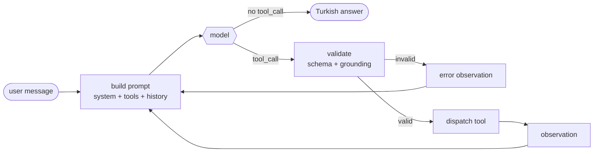

<div align="center">

# 🇹🇷 Llama Turkish Function-Calling Agent

**Llama-3.1-8B → QLoRA → GGUF → a tool-calling agent that answers in Turkish, on a single 8 GB laptop GPU.**

<p>
  
  
  
  
  
  
</p>

<table>
<tr>
<td align="center"><b>94%</b><br><sub>on tool schemas<br>never seen in training</sub></td>
<td align="center"><b>100%</b><br><sub>valid JSON<br>with grammar off</sub></td>
<td align="center"><b>~40</b><br><sub>tokens/sec<br>generation</sub></td>
<td align="center"><b>2%</b><br><sub>Turkish share of<br>the training mix</sub></td>
</tr>
</table>

</div>

---

## 🎯 The question

Most function-calling fine-tunes are trained and evaluated in English. This project asks a narrower one:

> Can a small, carefully-curated Turkish subset — about **2%** of the training mix — reliably steer a model's *final, user-facing* answers into Turkish, without touching the English tool-calling semantics that make up the rest, and without anything close to a large Turkish corpus?

The answer depends entirely on **how** that 2% is trained on, not just that it exists. That distinction drives most of what follows.

---

## ⚡ Quick start

```bash
# 1 — serve the model (keep this terminal open)
cd <llama.cpp build directory>
LD_LIBRARY_PATH=.:$LD_LIBRARY_PATH ./llama-server \
  -m training/outputs/gguf/llama31-8b-tr-Q4_K_M.gguf \
  -c 8192 -np 1 -ngl 99 -fa on \
  --cache-type-k q8_0 --cache-type-v q8_0 \
  --host 127.0.0.1 --port 8080

# 2 — talk to it
python inference/orchestrator.py --verbose
```

```
siz > Yarın Ankara'da hava nasıl olacak?
  · get_weather({'location': 'Ankara', 'days_ahead': 1}) -> ok
ajan> Ankara'da yarın hava parçalı bulutlu olacak; sıcaklık 14 ile 26 derece
      arasında seyredecek ve yağış ihtimali görünmüyor. …
```

<sub>`--verbose` logs each tool call and its outcome · `--variant` picks a system prompt · `--grammar` enables constrained decoding</sub>

---

## 🔄 How a turn works



The loop is capped at 6 iterations, de-duplicates repeated calls, prunes old observations when the context budget tightens, and **never dispatches a call whose arguments cannot be traced back to the conversation**.

---

## 🧩 Key design decisions

| | |
|---|---|
| 🌍 **Hybrid language strategy** | System prompts, tool schemas and `tool_call` JSON stay English throughout. Only the user-facing layer is localized — the model isn't learning a new skill in Turkish, only redirecting an existing one. |
| 🎭 **Two-layer loss masking** | "Train on responses only" computes loss over *every* assistant turn, including English final-turn prose. Unmasked, that is a gradient contradicting the Turkish instruction at the same token position for most of the run. Masking the English final turn makes the Turkish subset the **sole** source of final-turn behaviour instead of fighting it at ~50:1. |
| 📦 **Quantization-aware merge** | An intermediate `q8_0` GGUF (half the disk of `f16`, no measurable K-quant cost) plus an **importance matrix** built from the real training distribution before the final `Q4_K_M` pass — a calibration run traded for a smaller quality gap at the same file size. |
| 🎲 **Single training run** | No retry budget. Dataset prep, masking and the Turkish subset are all built to be auditable **before** the run, not patched after. |
| 🔧 **Control lives in code** | Where the model has a learned habit a prompt cannot reliably override, the orchestrator or the tool enforces the behaviour instead. Every case below was *measured*, not assumed. |

---

## 📊 Evaluation

`eval/test_set.jsonl` is a **74-record held-out set, written by hand**. It was screened against the training data for verbatim matches and at a 0.70 similarity threshold — five real leaks were found and rewritten. Every tool name claimed as "unseen" was checked against all **2,985** tool names in the training data; intuitive picks like `convert_currency`, `translate_text` and `find_restaurants` turned out to be present and were replaced.

Scored with the **grammar off**, so the numbers reflect what the model produces unaided:

| Metric | Score | |
|---|---|---|
| 🔓 **Unseen tool schemas** | **18/19** | `██████████ 94%` |
| 🔑 Seen tool schemas | 41/44 | `█████████░ 93%` |
| ✅ JSON validity | 40/40 | `██████████ 100%` |
| 🗣️ Turkish final turn after an observation | 6/6 | `██████████ 100%` |

> **The first two rows are the whole point.** Equal performance on schemas the model has never seen means it learned *"read the schema, build the call"* rather than memorizing tool names.

Records where more than one behaviour is defensible are **reported, not scored**. Inventing a reference answer to make a metric look complete would have made the metric worse.

---

## 🔬 What measurement changed

Each of these was a live or evaluated failure, traced to a cause, and fixed **in code** rather than by rewording a prompt.

<details>
<summary><b>🕳️ The masking silently deleted training data</b></summary>

Hermes examples that answer directly, without a tool, consist of nothing *but* a final turn — so masking the final turn masked the whole example and dropped it. **803 of 851** such examples vanished, leaving a **1:71** skew toward calling a tool. The model over-triggered exactly as that ratio predicts.
</details>

<details>
<summary><b>👻 The model fabricates arguments it does not have</b></summary>

`"Hava nasıl?"` (no city given) produced `location='Ankara'`. `"Ankara'dan tren var mı?"` produced `destination="user's destination"` — a literal placeholder, meaning the model *knows* it does not know and fills the slot anyway. No prompt variant fixed it, so `orchestrator._ungrounded()` refuses to dispatch such a call and asks the user instead.
</details>

<details>
<summary><b>1️⃣ <code>num_results=1</code> was learned, not chosen</b></summary>

The training data calls `google_search` with `num_results=1` in **34 of 55** cases. The model asks for one source out of habit. The tool now treats the parameter as a **floor**, not a ceiling.
</details>

<details>
<summary><b>🤖 A blocked search was reported as an empty one</b></summary>

DuckDuckGo answers **HTTP 202 with a CAPTCHA** after ~7 requests on `/lite` and after **2** on `/html`; the tool read that as a successful search with zero hits and told the model *"nothing was found"* — which the model then relayed to the user as fact. Scraping was measured to be unworkable here, so search became a provider chain with explicit block detection, and every failure message now tells the model not to claim it searched.
</details>

<details>
<summary><b>✂️ Short answers are a learned length</b></summary>

Turkish final turns in the training data have a **median of 118 characters**. A length instruction in the system prompt barely moved it; the same instruction rendered *immediately before generation* does — recency is what matters, not wording.
</details>

---

## 🏗️ Architecture

```
training/
  prepare_dataset.ipynb     # Hermes -> Llama-3.1 chat template conversion
  train.py                  # QLoRA fine-tuning with two-layer loss masking
  merge_and_quantize.py     # LoRA merge -> GGUF (q8_0 -> imatrix -> Q4_K_M)
  turkish_examples/         # Curated Turkish subset + curation methodology

inference/
  config.py                 # .env reader (stdlib only, no python-dotenv)
  prompts.py                # System prompt + variants; one source for agent AND eval
  serve.py                  # HTTP client to llama-server (model access layer)
  orchestrator.py           # ReAct loop: parsing, grounding, pruning, limits
  grammar/generate_gbnf.py  # GBNF generated from the live tool registry
  tools/                    # Registry + google_search, get_weather, get_system_time

eval/
  test_set.jsonl            # 74-record held-out set, 19 of them on unseen schemas
  test_set_SEMA.md          # Record schema and scoring rules
  eval_post_quant.py        # Scores the quantized model against the set
  eval_pre_quant.py         # bfloat16 baseline (not run — see Status)
```

`tools/__init__.py` is the hub: the system prompt, the grammar and the dispatcher all read from the same registry, so one can never be updated while another is forgotten.

---

## 💻 Hardware

Training and inference run on **different machines on purpose**, and the pipeline is built around that split.

| Stage | Hardware | Role |
|---|---|---|
| 🏋️ Training | 4× H100 (cloud) | QLoRA fine-tuning in bfloat16 |
| 🔀 Merge & quantize | CPU (cloud VM) | LoRA merge, GGUF conversion, imatrix calibration |
| 🎮 Inference | RTX 4060 Laptop, 8 GB | GGUF served by `llama-server` (llama.cpp, Vulkan) |

Measured at `n_ctx=8192`, `Q4_K_M`, q8_0 KV cache, flash attention:

| | |
|---|---|
| Model weights | 4403 MiB |
| KV cache | 544 MiB · **68 KB/token** |
| Compute buffer | 108 MiB |
| **Total** | **5055 / 7774 MiB** — ~2.7 GB headroom |
| Generation | ~40 tok/s |
| Prompt processing | ~175 tok/s |

> 💡 **Memory turned out not to be the binding constraint — prompt processing is.** Every 1000 tokens of context costs ~6 seconds on *every* subsequent turn. That is why the orchestrator trims context and the search tool trims its own output.

<details>
<summary><b>Why <code>llama-server</code> instead of in-process <code>llama-cpp-python</code></b></summary>

The spec called for an in-process `Llama()` object. That needs the CUDA toolkit, which this machine does not have, while llama.cpp's prebuilt **Vulkan** binaries already worked. `serve.py` is therefore an HTTP client. Nothing was lost — every setting the spec required exists as a server flag, and prefix caching works over HTTP (measured: **14 tokens processed instead of 440** on the second request). Something was gained: the model process now survives across sessions, not just turns.
</details>

---

## 📦 Setup

```bash
pip install -r requirements.txt
# torch is installed separately, matching your CUDA version:
python -m pip install torch --index-url https://download.pytorch.org/whl/cu121
```

> Inference needs **no Python dependencies beyond the standard library** — only a running `llama-server`.

### 🔎 Search provider

Copy your [Tavily](https://app.tavily.com) key into `.env` (git-ignored):

```ini
TAVILY_API_KEY=tvly-...
```

The chain is **Tavily → DuckDuckGo → Wikipedia**. Tavily leads because it is the only provider here not fighting a bot filter, and because it returns page text directly — its results skip the page-fetch step entirely. Without a key the agent still runs on the keyless fallbacks, which last a handful of queries before DuckDuckGo starts serving CAPTCHAs.

Adding another provider means writing **one function** and listing it in `PROVIDERS`.

---

## 🚦 Status

| Component | |
|---|---|
| Dataset preparation (Hermes + Turkish subset) | ✅ Done |
| QLoRA training script | ✅ Done |
| LoRA merge / GGUF quantization pipeline | ✅ Done, validated end-to-end |
| Tool layer + registry | ✅ Done |
| GBNF grammar generation | ✅ Done *(optional — see below)* |
| Inference server & ReAct orchestrator | ✅ Done |
| Evaluation harness | ✅ Done |
| bfloat16 baseline comparison | ❌ **Not possible** — the merged bf16 model was deleted by the quantize pipeline before a baseline was taken |

The grammar layer is **insurance, not a requirement**: the model produced 100% valid JSON with it switched off. It earns its keep once temperature rises above zero and contexts grow.

---

## 🛠️ Commands

```bash
python inference/orchestrator.py --verbose            # interactive agent
python eval/eval_post_quant.py --out eval/report.json # score against the test set
python inference/grammar/generate_gbnf.py             # regenerate the grammar
```

Training and merge/quantize scripts run independently — see the comment block at the top of each script for hardware assumptions and expected runtimes.
